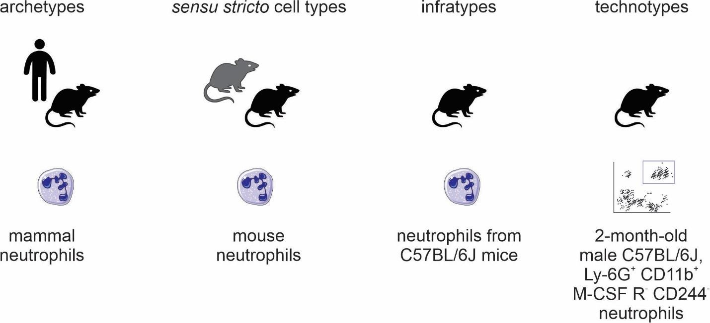

---
title: Manuscript Title
keywords:
- markdown
- publishing
- manubot
lang: en-US
date-meta: '2021-06-13'
author-meta:
- John Doe
- Jane Roe
header-includes: |-
  <!--
  Manubot generated metadata rendered from header-includes-template.html.
  Suggest improvements at https://github.com/manubot/manubot/blob/main/manubot/process/header-includes-template.html
  -->
  <meta name="dc.format" content="text/html" />
  <meta name="dc.title" content="Manuscript Title" />
  <meta name="citation_title" content="Manuscript Title" />
  <meta property="og:title" content="Manuscript Title" />
  <meta property="twitter:title" content="Manuscript Title" />
  <meta name="dc.date" content="2021-06-13" />
  <meta name="citation_publication_date" content="2021-06-13" />
  <meta name="dc.language" content="en-US" />
  <meta name="citation_language" content="en-US" />
  <meta name="dc.relation.ispartof" content="Manubot" />
  <meta name="dc.publisher" content="Manubot" />
  <meta name="citation_journal_title" content="Manubot" />
  <meta name="citation_technical_report_institution" content="Manubot" />
  <meta name="citation_author" content="John Doe" />
  <meta name="citation_author_institution" content="Department of Something, University of Whatever" />
  <meta name="citation_author_orcid" content="XXXX-XXXX-XXXX-XXXX" />
  <meta name="twitter:creator" content="@johndoe" />
  <meta name="citation_author" content="Jane Roe" />
  <meta name="citation_author_institution" content="Department of Something, University of Whatever" />
  <meta name="citation_author_institution" content="Department of Whatever, University of Something" />
  <meta name="citation_author_orcid" content="XXXX-XXXX-XXXX-XXXX" />
  <link rel="canonical" href="https://lubianat.github.io/fapesp_report_1/" />
  <meta property="og:url" content="https://lubianat.github.io/fapesp_report_1/" />
  <meta property="twitter:url" content="https://lubianat.github.io/fapesp_report_1/" />
  <meta name="citation_fulltext_html_url" content="https://lubianat.github.io/fapesp_report_1/" />
  <meta name="citation_pdf_url" content="https://lubianat.github.io/fapesp_report_1/manuscript.pdf" />
  <link rel="alternate" type="application/pdf" href="https://lubianat.github.io/fapesp_report_1/manuscript.pdf" />
  <link rel="alternate" type="text/html" href="https://lubianat.github.io/fapesp_report_1/v/b0a999fdcaa7d738c6d8d68c0599a1a67a4457ff/" />
  <meta name="manubot_html_url_versioned" content="https://lubianat.github.io/fapesp_report_1/v/b0a999fdcaa7d738c6d8d68c0599a1a67a4457ff/" />
  <meta name="manubot_pdf_url_versioned" content="https://lubianat.github.io/fapesp_report_1/v/b0a999fdcaa7d738c6d8d68c0599a1a67a4457ff/manuscript.pdf" />
  <meta property="og:type" content="article" />
  <meta property="twitter:card" content="summary_large_image" />
  <link rel="icon" type="image/png" sizes="192x192" href="https://manubot.org/favicon-192x192.png" />
  <link rel="mask-icon" href="https://manubot.org/safari-pinned-tab.svg" color="#ad1457" />
  <meta name="theme-color" content="#ad1457" />
  <!-- end Manubot generated metadata -->
bibliography:
- content/manual-references.json
manubot-output-bibliography: output/references.json
manubot-output-citekeys: output/citations.tsv
manubot-requests-cache-path: ci/cache/requests-cache
manubot-clear-requests-cache: false
...

<small><em>
This manuscript
([permalink](https://lubianat.github.io/fapesp_report_1/v/b0a999fdcaa7d738c6d8d68c0599a1a67a4457ff/))
was automatically generated
from [lubianat/fapesp_report_1@b0a999f](https://github.com/lubianat/fapesp_report_1/tree/b0a999fdcaa7d738c6d8d68c0599a1a67a4457ff)
on June 13, 2021.
</em></small>

## Authors

+ **John Doe** 
    {.inline_icon}
    [XXXX-XXXX-XXXX-XXXX](https://orcid.org/XXXX-XXXX-XXXX-XXXX)
    · {.inline_icon}
    [johndoe](https://github.com/johndoe)
    · {.inline_icon}
    [johndoe](https://twitter.com/johndoe) 
  <small>
     Department of Something, University of Whatever
     · Funded by Grant XXXXXXXX
  </small>

+ **Jane Roe** 
    {.inline_icon}
    [XXXX-XXXX-XXXX-XXXX](https://orcid.org/XXXX-XXXX-XXXX-XXXX)
    · {.inline_icon}
    [janeroe](https://github.com/janeroe) 
  <small>
     Department of Something, University of Whatever; Department of Whatever, University of Something
  </small>

UNIVERSIDADE DE SÃO PAULO
FACULDADE DE CIÊNCIAS FARMACÊUTICAS
Departamento de Análises Clínicas e Toxicológicas

Study of transmission of diseases using cell phones data from infected people

Direct Doctorate Project - Report 1
FAPESP process number: 2019/16419-7
Project term: 01/09/2019 to 31/08/2023
Period of Scientific report: 01/09/2019 to 30/11/2020

Scholarship Holder: Jeevan Giddaluru
Responsible Researcher: Prof. Dr. Helder Takashi Imoto Nakaya

São Paulo - SP
November 2020

# Project summary

The advent of single-cell technologies has ignited the desire of a deep knowledge on cells, the building blocks of life [@wikidata:Q99418649]. 
The Human Cell Atlas (HCA) project, has been a major player in the cell knowledge ecosystem, running since 2017 towards the task to characterize every cell type in the human body [@wikidata:Q46368626]. The HCA consortium recruited people from all over the world to tackle different parts of the project. In Brazil, Prof. Helder Nakaya (supervisor of this PhD project) is leading the national effort to contribute to HCA, with a focus on the roles of different cell types in the pathological processes of infectious and inflammatory diseases.

HCA is set to revolutionize the biomedical sciences, by creating tools and standards for basic research, as well as allowing better characterization of disease, and thus, ultimately, improving diagnostics and therapy. 
Its products (data, information, knowledge and wisdom) need to be FAIR: findable, accessible, interoperable and reusable.
Data stewardship and data management are growing as core demands of the scientific community, ranging from data management plans [@wikidata:Q56524391] to specialized personnel [@wikidata:Q56524391].

The Human Cell Atlas has a dedicated team for organizing data: the Data Coordination Platform (DCP) [@url:https://data.humancellatlas.org/about] [@wikidata:Q104450645].
The DCP is responsible for tracing the plan for computational interoperability, from the data generators to the consumers.[@wikidata:Q104450645].
The Human Cell Atlas  has its portal for data (<https://data.humancellatlas.org/>) which composes the data repository landscape with other resources, like the Broad Institute Single Cell Portal (<https://singlecell.broadinstitute.org/single_cell>) and the Chan-Zuckerberg Biohub Tabula Sapiens (<https://tabula-sapiens-portal.ds.czbiohub.org/>). 
In addition to its core team, the HCA is poised to grow by community interaction, and states in its opening paper that "As with the Human Genome Project, a robust plan will best emerge from wide-ranging scientific discussions and careful planning".[@wikidata:Q46368626]  
Thus, this project inserts itself among the wide-ranging scientific discussions to improve data - and knowledge - interoperability. 

The large amount of information generated by HCA creates the need for innovative knowledge management approaches.
For the Human Cell Atlas Project (as presented in the chapter <!-- 1.4. The challenges of the Human Cell Atlas -->) to maximize its benefit for society,  its knowledge products will need to be inserted into the main route of automated knowledge discovery .  
The field denominated Literature Based Discovery [@url:https://en.wikipedia.org/wiki/Literature-based_discovery] dedicates itself to this challenge: making actual discoveries (or at least very strong hypothesis) using as material plainly the existing literature. [@wikidata:Q38371706]
The textbook example of Literature Based Discovery is described by Don Swanson's so-called ABC model: If A is related do B, and B is related to C, then A and C are indirectly related [@wikidata:Q36280460]
In a seminal paper, Swanson showed an hypothesis about using fish oil (A) to treat Raynauld's disease (C), demonstrating that even though the specialized fish-oil (A) literature had shown its association (AB) with a set of blood parameters (B), and the specialized Raynauld's disease literature had show its association (BC) with the same set of parameters (B), the AC link was never made in the literature, despite its seeming obviousness [@wikidata:Q36280460].

Modern advancements of literature-based discovery rely on Natural Language Processing, Machine Learning and Knowledge graphs to make inferences on literature knowledge.
Word embeddings, for example, are leading inference of properties of compounds based on their shared neighbourhood of words (the words before and after their mentiongs) with known compounds, thus making use of latent knowledge in the body of knowledge. [@wikidata:Q91595456]
Other, more explicit approaches, rely on extracted relations embedded in knowledge graphs,fo example, the discovery of new RNA-binding proteins related to Amyotrophic Lateral Sclerosis by analysis of the Watson Drug Discovery gene-disease network. [@wikidata:Q47406275]
Knowledge graphs have a set of characteristics that make then useful for Literature Based Discovery: the power of representing multiple relations, the power of making inferences on top of those relations, and provide human understandability at every step, allowing for a dialog between expert humans and computing systems.
The field of biomedical ontologies explores that direction in depth, and the community is building many solutions, widely applicable for the biomedical sciences.

An ontology, as used here, is a formal computational representation of reality, which tries to represent each concept (and their relations) as precisely as possible.  [@wikidata:Q105870680]  Constructing an ontology is a process of selecting and defining terms of interest, 
selecting and defining relationships of interest and making statements about reality using terms and relationships. The Gene Ontology is probably the most well known biomedical ontology; it describes (among other things) different classes of biological process, related to each_other by "is_a" and "part_of relations. [@wikidata:Q104130127] [@wikidata:Q23781406].

The Gene Ontology is part of a much larger effort to formalize concepts across biology: the Open Biomedical and Biological Ontologies (OBO) Foundry. [@wikidata:Q19671692]
Created in 2007, the OBO Foundry is a hub of biomedical ontologies that sets guidelines for the design and construction of high-quality ontologies. 
The initial OBO Foundry united several independent ontologies, like the Cell Ontology (CL), the Disease Ontology (DO) and the Protein Ontology (PRO) under a common framework, a great progress towards interoperability. 
At the same time, the creation of the Relation Ontology (RO) provided a go-to point for relations in biology that could them be reused by different ontologies.

Ontologies are powerful, but require a high degree of tecnichal expertise to get started. 
Recently, a new approach for formal knowledge representation arose with the dawn of collaborative knowledge graphs.
Wikidata, the collaborative knowledge graph of the Wikimedia foundation, allows users to contribute with classes and statements, in the same spirit of Wikipedia and share its "epistemic virtues, like power, speed and availability. [@wikidata:Q101955295]
It is powerful because of its large community of contributors. With a community of more than 25,000 active editors (https://www.wikidata.org/wiki/Wikidata:Statistics) and growing, it is able to cover a much wider number of concepts than any user individually. 
It is fast, because one does not need to install any software or ask for permissions to update it: any user can simply do it via a web interface. 
That speed makes it easier for newcomers to join and contribute, in contrast to OBO Foundry ontologies, which require extensive training on semantics and knowledge of Git/GitHub for contributions. 
Finally, the information on Wikidata is available via an user interface, via a SPARQL query service and as large, full-size database dumps, providing full extent reusability. 
The Wikidata model has been so sucessfull that Google decided to migrate its own knowledge base, Freebase, fully into Wikidata.[@wikidata:Q24074986]

Several advances towards biological data integration and biological data analysis in Wikidata have been made before, yielding positive results [@doi:10.1101/031971] [@wikidata:Q87830400] and showcasing its potential for bioinformatics-related analyses, such as drug repurposing and ID conversion [@doi:10.7554/eLife.52614]. 
Wikidata has been proposed as a unified base to gather and distribute biomedical knowledge, with more than 50 000 human gene items indexed and hundreds of biomedical-related properties [@doi:10.1016/j.jbi.2019.103292].

The aim of this project is to to study current understanding of cell types for development a comprehensive ontological model in Wikidata for cell types. 
We are reviewing the single-cell literature, refining and formalizing concepts for cell type delimitation and exploring their application in the Wikidata database.
At the same time, we are exploring the use of Natural Language Processing tools, in combination with expert annotations 
tools to automate knowledge extraction from scientific articles in the scope of the Human Cell Atlas. 
The specific goals outlined in the approved project were:

- Build a data model to capture the main properties to describe a human cell. Provide working definitions of cell types and states and their characteristics.
- Extract and add to Wikidata pieces of information regarding Human Cell Atlas publications to build gold standards. Use this information to develop machine learning tools to extract knowledge from publications.
- Create tools to make data from the underlying knowledge graph accessible employing tools from network theory.

# Achievements 

In the first year of the project, we addressed 3 different facets of the project. 
The first facet dealt with the concept of cell type itself, in the goal of building theoretical models for the formalization of knowledge. 
The second facet was aimed at the practical application of the concepts. 
We adapted a public database of cell type markers, Panglao DB, to the Wikidata format, made the information available through Wikidata and perfomed SPARQL (SPARQL Protocol and RDF Query Language) queries to glance at the information on the database. 
Finally, we manually annotated articles in the Human Cell Atlas Publications collection to gain insights on the types of knowledge available about cell types and paving the way for automated and crowdsourced approaches. 

## Concept of cell types

The definition of the concept of "cell type" is currently a topic of debate by the biomedical community.[@wikidata:Q87649649; @doi:10.1242/dev.169854; @doi:10.1242/dev.178996; @wikidata:Q47565008; @wikidata:Q99418657; @wikidata:Q98665291; @wikidata:Q93086971; @wikidata:Q26770736; @wikidata:Q35688096; @wikidata:Q98633613; @wikidata:Q99418649; @wikidata:Q40436539].
In an opinion article published in Cell Systems in 2017, a series of researchers presented their views on the conceptual definition of 'cell type' in the context of a mature organism [@wikidata:Q87649649].
Many scientists believed that cell functions have a core role in defining cell types, which is a slippery road, as the very meaning of "function" in biology is elusive [@doi:10.7554/eLife.47014].
The opinions were varied, and no consensus was achieved.

As much as different concepts of species coexist [@doi:10.1080/10635150701701083], our quest to define cell types may take various forms.
The challenge of representing cell types in the context of evolution is conceptually different from representing cell types in biomedical experimentation.
In that second direction, the groundwork of the Cell Ontology [@wikidata:Q21184168; @doi:10.1186/1471-2105-12-6; @doi:10.1186/s13326-016-0088-7] and   CELDA [@wikidata:Q21284308]  and the contributions of the International Workshop on Cells in Experimental Life Sciences series [@doi:10.1186/s12859-017-1976-2; @doi:10.1186/s12859-019-2721-9] are notable.

In this work, we targeted the question: which cell type definition allows crafting coherent biological statements? 
The goal is to not say what cell types _are_, but what they can be for a consistent representation on a knowledge graph, like Wikidata.
We also assume that biological statements that derive from experimentation should be logically valid, and thus aim to distill ways to resolve ambiguities in natural language statements makes knowledge unresolvable (i.e. neither true nor false).
Furthermore, for the practical purpose adopted here, we avoid the dissection of the differences between persistent classes of cells (often called "cell types") or the transient, fugacious classes of cells (often called "cell states") (see "Definition of cell identity" section in [@wikidata:Q48563763] for an example).
Even though such a distinction is an essential topic for theoretical research, it is not required to represent formally biomedical experiments.

To facilitate communication among life scientists, in a preprint derived from this PHD project[@doi:10.22541/au.160979530.02627436/v1], we proposed naming conventions for different cell types classes. 
Much of the literature mixes cell types in one species (e.g., when dealing with a cell type as an evolutionary unit) or multiple species (e.g., in the Cell Ontology). 
It is useful to distill these different concepts into names. Given the importance of the species' concept in biological classification [@wikidata:Q1189395], we derive a species-centric view on the naming of classes of cell types. 
The four classes (Figure @fig:classes) we propose are as follows:

- archetypes, for when the taxonomic scope of the type is beyond the level of species; for example, "mammal neutrophils."
- _sensu stricto_ cell types, for when the taxonomic scope of the type corresponds to a single species; for example, _Mus musculus_ neutrophils."
- infratypes, for when the taxonomic scope is below the level of species; for example, considering the mouse strain "C57BL/6J", "neutrophils from C57BL/6J mice". 
- technotypes, for specific, experimentally defined cell types that harbor in their definition the precise conditions of the cells sampled; “2-month-old male C57BL/6J, Ly-6G+ CD11b+  M-CSF R-  CD244- neutrophils”.

{#fig:classes}

The 4 different categories of cell types help us to better organize the knowledge about cell types. 
Even though individual articles and databases often have species-neutral names, the information often comes from experiments with a single strain of a single species.
Two articles might call by the same name cells that come from different animals, or were selected by different protocols. 
Large scale knowledge management requires an organized way of representing those details.

The division between archetypes and _sensu stricto_ cell types is of special importance in the context of biocuration and annotation of data. 
Associations like the  HUGO Gene Nomenclature Committee and UniProt organize names and identifiers for genes and proteins in single species. 
Thus, if we want to annotate marker genes, for example, we need to associate them to a species-specific cell type (a _sensu stricto_ cell type) instead of the more vague association to a species-neutral type. 
That might seem obvious, but current standards still use identifiers that are species-neutral (e.g. in the reference HuBMAP app; <https://azimuth.hubmapconsortium.org/references/>)

The ontological discussion on the classes of cell types, thus, extends the current state-of-the-art and introduce new ways to organize our knowledge about cells. 
Notably, the technotype and the infratype are, currently, mostly theoretical constructs and almost no resources deal with cell types at the level of strains or below. 
The division of archetypes and _sensu stricto_ cell types, on the other hand, was already instrumental for the integration of the Panglao database of cell markers to Wikidata, described in the next session.

## PanglaoDB integration to Wikidata

## Annotation of the HCA corpus

## References {.page_break_before}

<!-- Explicitly insert bibliography here -->

